# Klaytn-DEX User Guide <!-- omit in toc -->

With the help of this guide, you will learn how to use Klaytn-DEX to perform all available actions on the blockchain, such as connect your wallet, swap tokens, farm and stake LP tokens, and so on. We will start by introducing the basic concepts used throughout the guide, and then walk you through all available functionality.

## Introduction <!-- omit in toc -->

Klaytn-DEX works with ERC-20 or KIP7 tokens. 

### Token Swap
Token swaps in Dex are a simple way to trade one ERC-20 or KIP7 token for another. Each pair of tokens on Dex is underpinned by a liquidity pool.

### Liquidity Pool

Liquidity pools are smart contracts that hold balances of two unique tokens and enforce rules on depositing and withdrawing them.

## Available Operations <!-- omit in toc -->

The guide covers the following operations available on Klaytn-DEX:

- [Connect Wallet](#connect-wallet)
- [Swap](#swap)
  - [Issues](#issues)
  - [Swap Preferences](#swap-preferences)
    - [Multi-hops](#multi-hops)
    - [Expert mode](#expert-mode)
- [LP Provision](#lp-provision)
  - [Add liquidity](#add-liquidity)
  - [Remove liquidity](#remove-liquidity)
- [Farming](#farming)
- [Staking](#staking)
- [Dashboard](#dashboard)
- [Governance](#governance)
  - [View proposals](#view-proposals)
  - [Vote](#vote)

## Connect Wallet

The first thing you need to do is to connect your wallet to DEX. DEX works with two wallets: Metamask and Kaikas. You have to have a wallet in either of those to be able to work with DEX.

0. Install Chrome extension for [Metamask](https://chrome.google.com/webstore/detail/metamask/nkbihfbeogaeaoehlefnkodbefgpgknn) or [Kaikas](https://chrome.google.com/webstore/detail/kaikas/jblndlipeogpafnldhgmapagcccfchpi) and create a wallet.

1. Open DEX. In the upper right corner, you will find a `Connect Wallet` button.
   
   Depending on which extensions you installed and which wallets you have, you will see the available options for connecting a wallet. For example, if you have a Kaikas wallet but not a Metamask one, this is what you will see:

   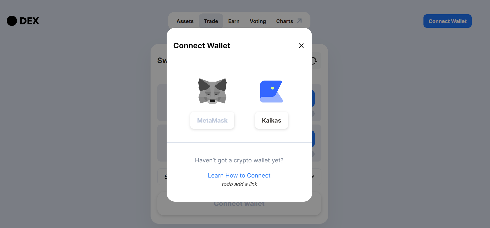

2. Choose a wallet to connect to DEX.

3. Agree to conditions and confirm that you trust the website:
   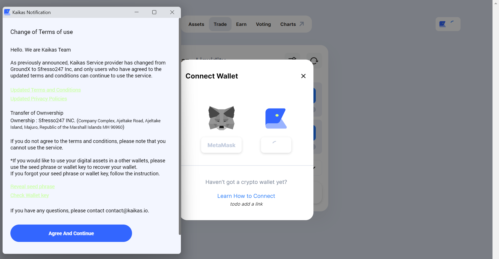
   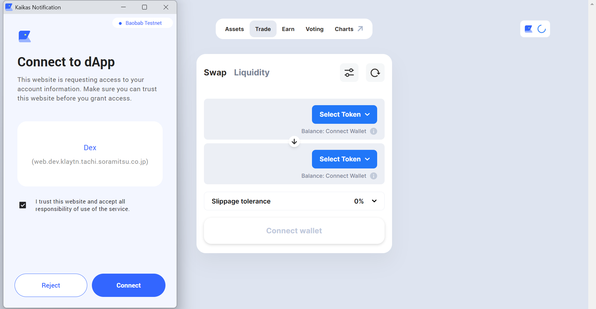

Once you have connected a wallet, you will see its information displayed in the upper right corner. The wallet address and balance are displayed:

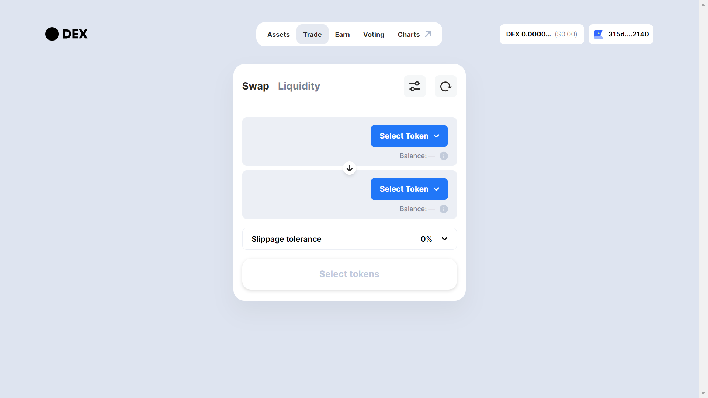

## Swap

You can swap tokens in the `Trade`>`Swap` tab.

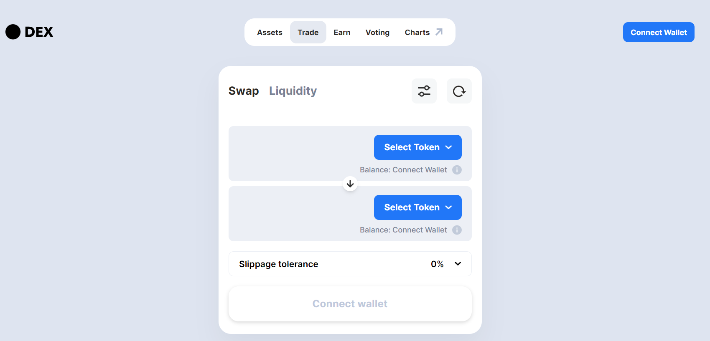

1. Select the pair of tokens you want to swap:

   

2. Put in the amount of tokens to swap. When you put a value in either of the boxes, the value for the other token will be calculated automatically:

   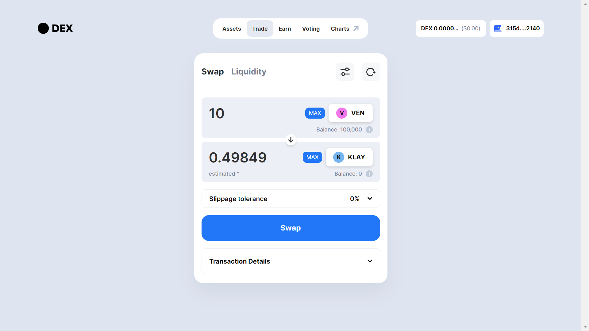

3. Set the slippage tolerance (the percentage of the total swap value you can tolerate losing due to the difference in actual price and the price at confirmation time). To do this, expand `Slippage tolerance` section and choose the percentage. For example, here we've chosen `0.5%`:

   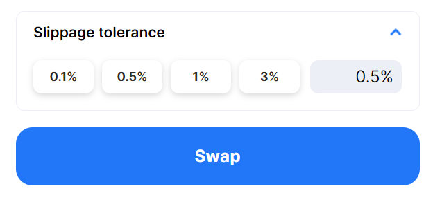

   Note that the lesser the tolerance, the greater the chance that the transaction will fail. Dex will warn you about this.

   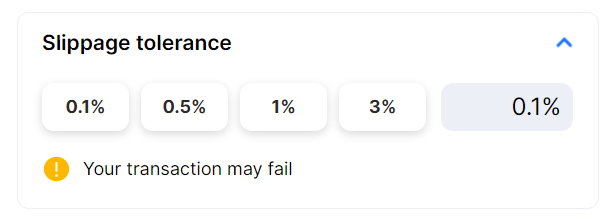

4. Expand `Transaction Details` to view the transaction details such as the price impact or the minimum amount of tokens you will receive.
  
   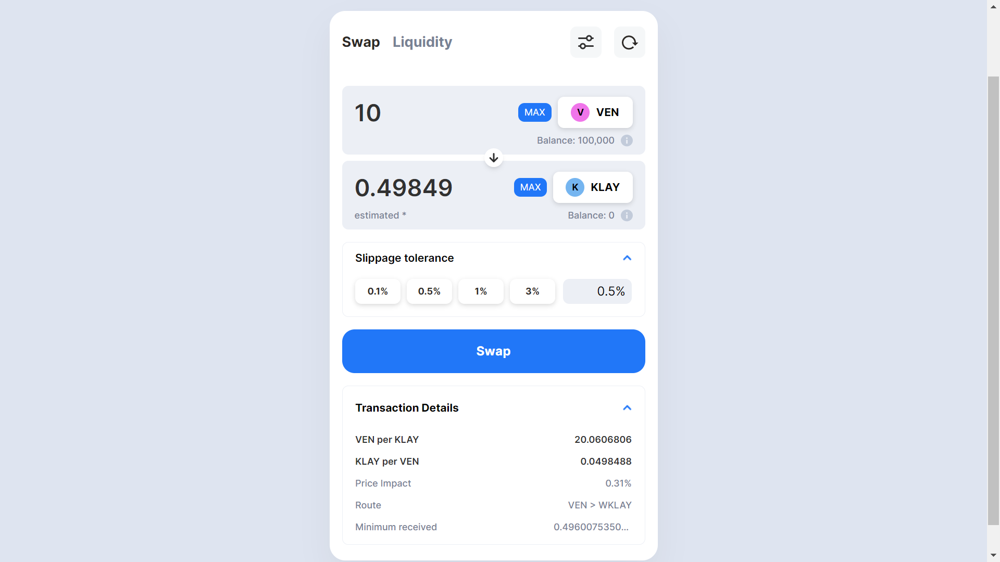

5. If you agree to the conditions of the transaction, press `Swap` and confirm the swap.

   <!-- confirmation screenshot-->

### Issues

You can face the following issues during the swap:

- Insufficient amount of tokens.
  
  If the amount of tokens you want ot swap is higher than what you have in your wallet, you won't be able to perform the swap.

  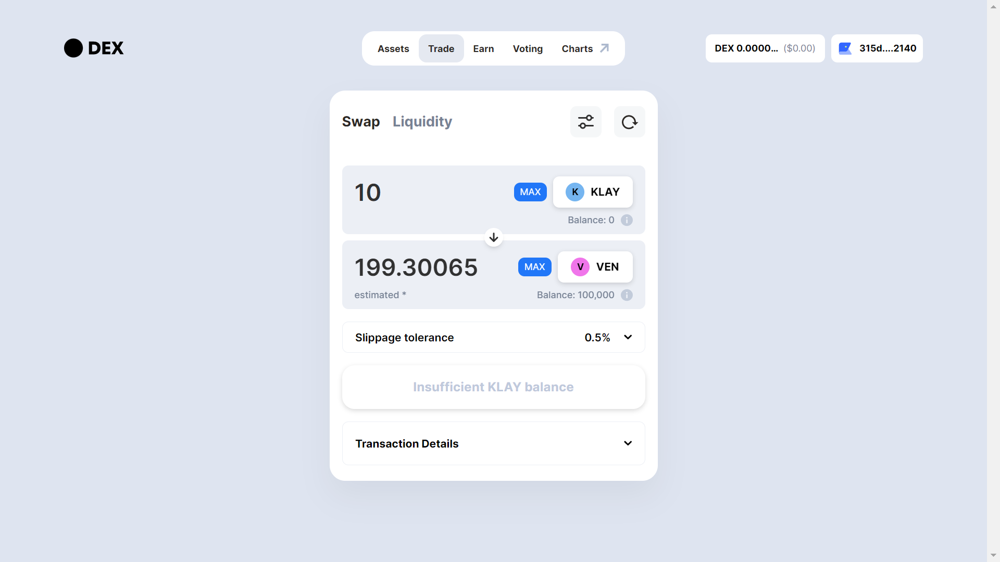

- Not enough KLAY for transaction fee.
  
  If you don't have enough KLAY tokens in your wallet, you will see this error after pressing `Swap`. You won't be able to confirm the transaction unless you have enough KLAY to pay the fee.

- Route between the pair of tokens is not found.
  
  Enable [multi-hops](#multi-hops) in the swap preferences to be able to swap a pair of tokens that doesn't have a liquidity pool.

### Swap Preferences

If you press the settings icon, you will see swap settings (enabling multi-hops and expert mode):

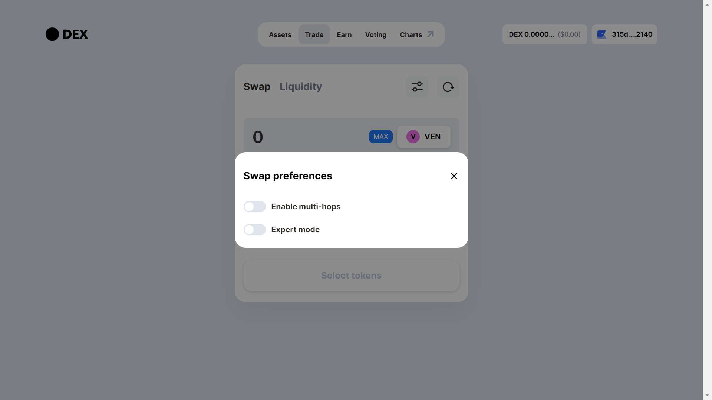

#### Multi-hops

If you enable multi-hops, you will be able to swap tokens that don't have a [liquidity pool](#liquidity-pool) for their pair.

Note the differences in route for two following swap operations:

- If multi-hops are disabled, there is no route between `VEN` and `DEX`:

  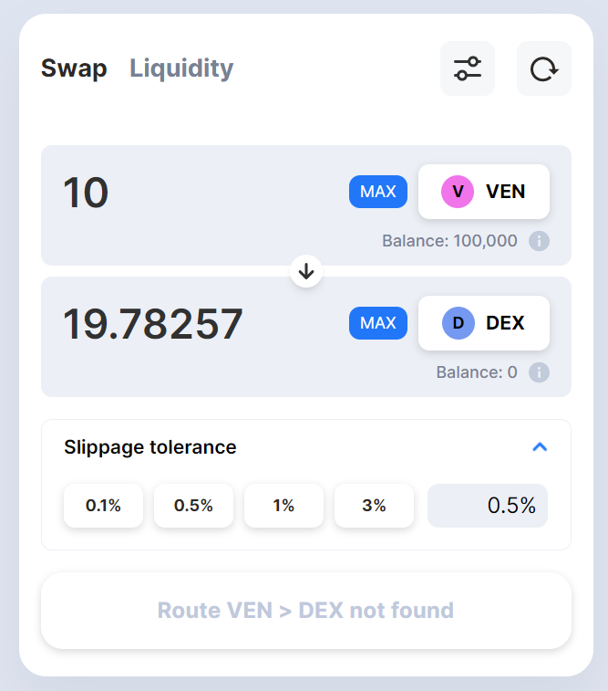

- If multi-hops are enables, there is a route between `VEN` and `DEX` through multiple other pairs:

  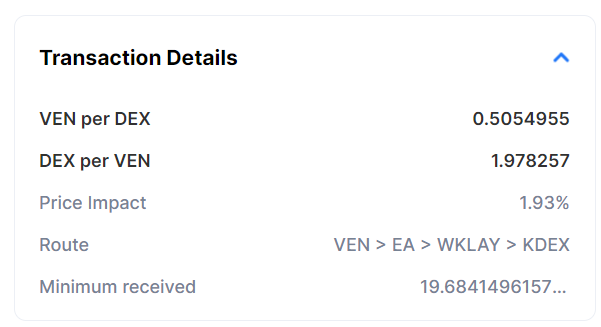

#### Expert mode

In expert mode, you only need to confirm access to the token once. After that it will be available for all future operations.

## LP Provision

Liquidity pools are smart contracts that hold balances of two unique tokens and enforce rules on depositing and withdrawing them.

Liquidity pools contain LP tokens. When you add liquidity to a liquidity pool, you receive LP tokens. When you remove liquidity, you remove LP tokens from the pool.

You can add and remove liquidity in the `Trade`>`Liquidity` tab:

- If you haven't joined any pool, you will only be able to add liquidity:

  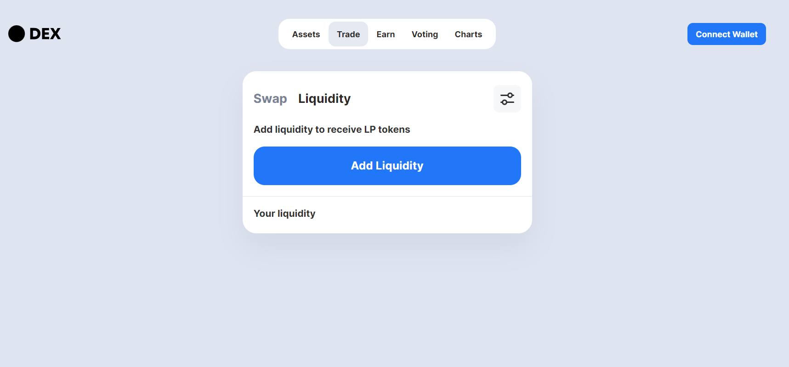

- If you already joined pools, you will see their information as well: 

  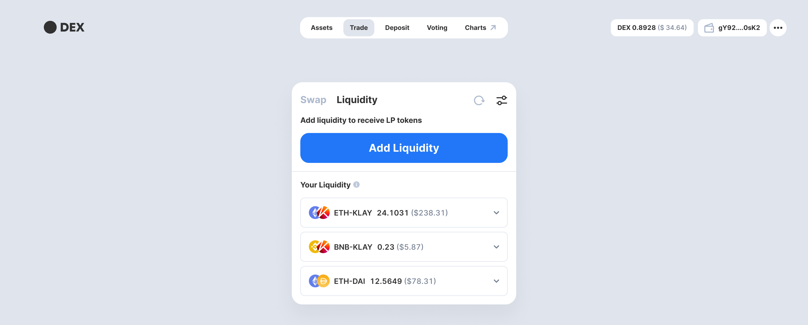

### Add liquidity

1. In the `Trade`>`Liquidity` tab, press `Add Liquidity`.

2. Select the pair of tokens:

   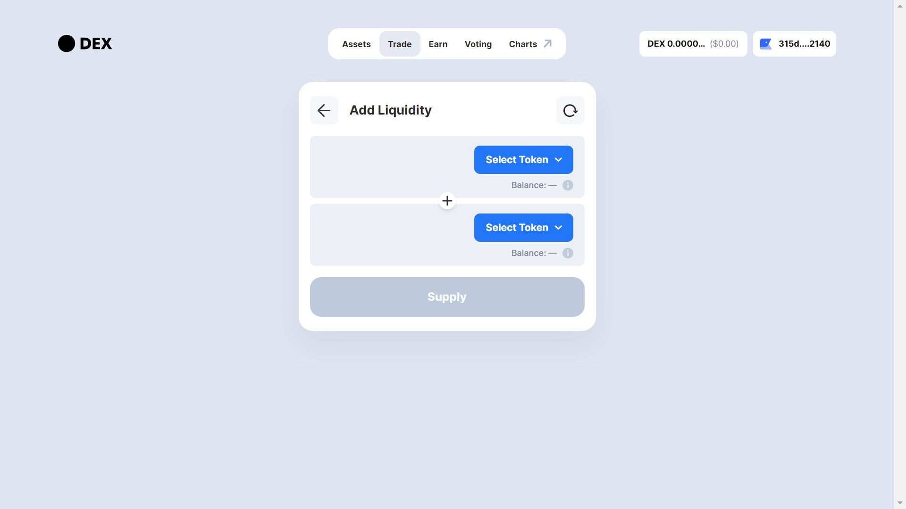

3. Specify the amount of tokens to add. Once you put in a value for any of the tokens, the value for the second token will be calculated automatically:

   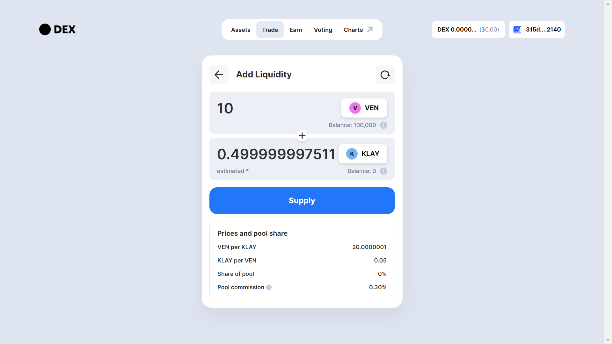

   The pool commission shows which percentage you will earn from all trades on this pair (proportional to your share).

4. Confirm supply.

### Remove liquidity

1. In the `Trade`>`Liquidity` tab, choose the pool from which you want to remove LP tokens.

2. Move slider to indicate how much tokens you want to remove.

   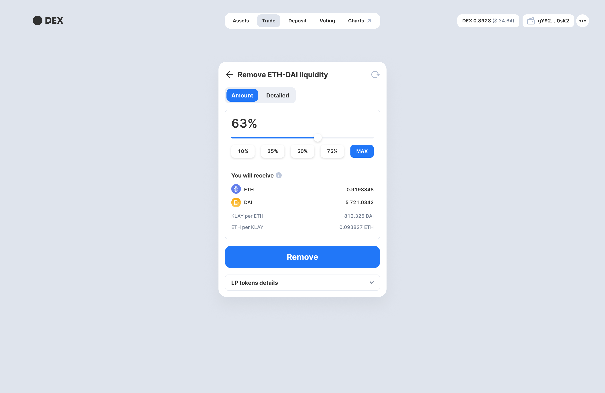

   Alternatively, you can also switch to the `Detailed` tab to put in the exact values.

   <!-- screenshot -->

3. Press `Remove`. You will see the details of the transaction.

<!-- screenshot -->

4. Confirm remove.

<!-- screenshot? -->

<!--

### Find LP tokens

-->

## Farming

<!-- copy from draft -->

## Staking

<!-- copy from draft -->

## Dashboard

<!-- copy from draft -->

## Governance

You can view proposals and vote for them.

### View proposals

In the `Voting` tab you can view all proposals: active, executed, defeated, finished. For each proposal, you see its start and end dates, title, and status.

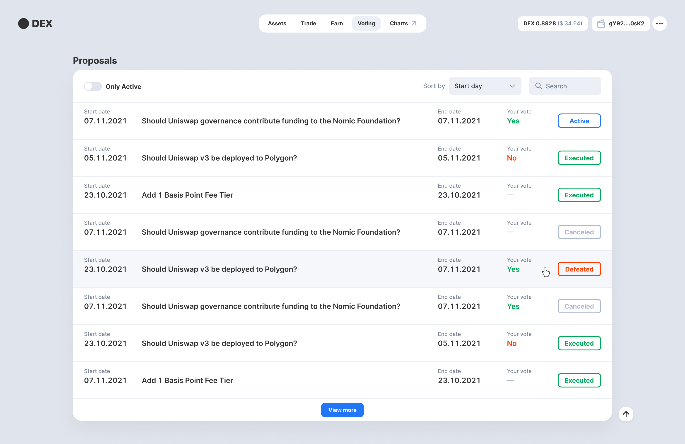

To show only active proposals, switch `Only Active` button in the upper left corner. You can also filter proposal either by their start date or end date.

To view details of a proposal, click on it, and you will be taken to the page that contains the detailed description of the proposal.

### Vote

Once you navigate to a proposal page, at the top of the page you will find the `Vote` button and the available voting options.

Click `Vote`. You will be taken to snapshot where you can cast your vote.
